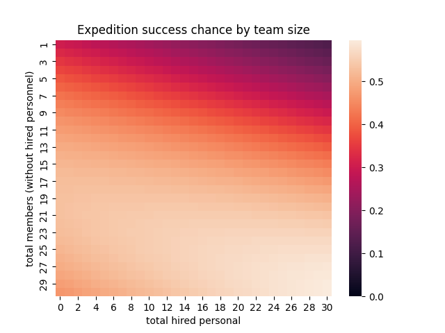

# Himalaya Project

## Introduction
The Himalaya Project is a personal project in which I attempted to model and predict the success chances of mountain climbing expeditions in the Himalaya region.

The goal of the project was to use data science methods to identify the most influential factors for the success of an expedition. Despite the technological advances of the last century, extreme mountain climbing remains a dangerous endeavour, and this project is an attempt to use data-driven techniques to find optimal expedition conditions. A 'successful' expedition is defined as an expedition which has reached its goal, i.e. summited the chosen peak via at least one of the planned routes. If several routes were planned for the same expedition, the expedition is considered a success if the climbing teams succeeded on any route. If accidents took place during descent, the expedition is still considered a success.

## Data
All data for this project was taken from [The Himalayan Database](https://www.himalayandatabase.com/), a "compilation of records for all expeditions that have climbed in the Nepal Himalaya". The data is available to the public free of charge via their software. I extracted the complete data and converted it to .csv files which can be found in the /data directory. The Database stores entries for expeditions from 1905 to 2022, with extesive information on expedition conditions, members and literary references.

## Methods
As a first step, I conducted some exploratory data analysis, which can be found in the file "EDA.py". The code plots several histrograms, scatter and bar plots to examine trends in the dataset. Initially, a modelling approach based on a random forest classifier was chosen. However, due to the large amount of categorical variables in the dataset, the decision trees performed quite badly. The model was replaced by a support vector machine, which increased performance (measured in ROC AUC). Due to the difficulty in interpreting SVMs, the model was again changed to a logistic classifier. The logistic model performed almost as good as the SVM, but offered simpler interpretation by examining the weighting coefficients. Thus, the SVM approach was abandoned completely.

The Logistic classifier takes the following expedition data into account:
 - year
 - season
 - which peak was climbed
 - whether the peak was traversed
 - wheter skiing and/or paragliding was employed
 - the amount of expedition members
 - the amount of hired personnel
 - whether oxygen was used during the ascent, descent or for sleep
 
Some data cleaning had to be done to remove entries which were unrecognized or where essential data (member count) was missing.
The fields for the peak and season were encoded using one-hot encoding. To make the model more complex, polynomial features (only up to degree 2, as the model started overfitting) were created for the member and hired personnel counts.
Stratified K-fold cross-validation was used to find the optimal regularization parameter for the classifier. The regularization was set to a L2 penalty, in an attempt to increase the model's predictive power. Generally, the model achieved ROC AUC scores around 0.7 - 0.75.

## Results
### EDA - trends over time
First, the EDA shows a drastic increase in expedition numbers in 1978 and 1996. The effects of Covid-19 are also apparent, especially in the year 2020:

We also find a steady incrase in the success ratio of expeditions over time:

Especially before 1980, the success rate data shows quite high variance due to the comparatively small amount of expeditions in that time. Changing the fit to only take into account data after 1980 does not drastically change the result.
Note that the expected success ratio has crossed the 0.6 threshold only recently, showing that even today, extreme mountian climbing remains a dangerous activity.

### EDA - peaks
Here we see statistics for the 30 peaks for which the most expeditions have been attempted:

It is clearly visible that the distribution is heavily skewed. EDA.py informs us that out of the 398 peaks for which data is available, the top 10 most popular peaks account for 72.58% of all expedition attempts. Mount Everest alone is the target of more than 20% of Himalayan expeditions.
Meanwhile, half of the Hamalayan peaks have been attempted to be summited no more than 3 times. Thus, **the classification model only takes into account peaks which have been attempted more than 5 times** for training.

### EDA - expedition group size
The EDA shows that expeditions with **group sizes exceeding 30 are rare** - both in expedition members as well as hired personnel:

For the analysis of the classification model, we will thus limit team sizes to 30 people.

### Classification
The logistic fit first performs stratified K-fold cross-validation in order to find the best regularization parameter. The results are printed to the console. Then, the 10 most influential fields are identified and printed to console as well. Most notable is the strong importance of **oxygen use during the ascent**. Additionally, the **total amount of expedition members** seems to be an important feature, as will be explored later on. Further important features are **oxygen use during sleep** and **peak traversal**, both helping success chances. Surprisingly, the **season in which the expedition takes place bears almost no signifcance to its outcome**. The other factors which were investigated were not found to have significant impact on the success chances.

The following plots shows predicted success chances of an average Himalaya expedition with respect to the amount of expedition members and hired personnel:

The plot was limited to these party sizes as expeditions with larger parties are rare, as found during EDA. Although barely visible in this plot, the success chance of an expedition begins to decrease again with increasing member count after a certain threshold (towards the bottom of the plot). Interestingly, while **hiring more personnel seems to always increase success chances, increasing the amount of expedition members only helps up to a certain limit - after which bringing more people will results in lower chances of success**.

## Conclusion
The Himalaya project identified that the most important factor (from the ones considered) for the success of a Himalayan expedition are the use of oxygen tanks during the ascent. Furthermore, oxygen use during sleep and choosing peak traversal routes seem to increase the chances of success. The project managed to identify a sweet spot in the expedition party size, and a steady increase in success chance with increasing numbers of hired personnel.

On the other hand, features such as the season and oxygen use during descent seem to have no bearing on success chances.

Although these results are interesting, they must be interpreted with caution as the model accuracy (ROC AUC) in only intermediate. A score of 0.7 shows the identification of some correlations, but is not the sign of a particularly strong classifier.
